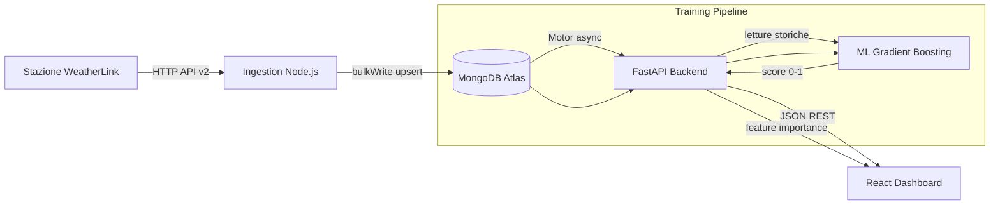
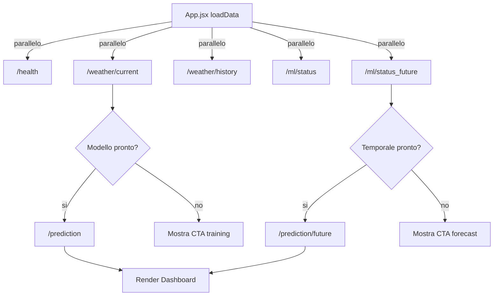

# MEtEO — Relazione Tecnica Completa

## Weather Intelligence for Logistics

**Progetto TPSIT** — Predizione AI del rischio di ritardo consegne basata su dati meteo in tempo reale.

---

## Indice

1. [Architettura generale](#1-architettura-generale)
2. [Raccolta dati (API meteo)](#2-raccolta-dati-api-meteo)
3. [Data ingestion](#3-data-ingestion)
4. [Database MongoDB](#4-database-mongodb)
5. [Backend FastAPI](#5-backend-fastapi)
6. [Modello AI (Gradient Boosting)](#6-modello-ai-gradient-boosting)
7. [Previsione nel tempo](#7-previsione-nel-tempo)
8. [Frontend React](#8-frontend-react)
9. [Logica del rischio](#9-logica-del-rischio)
10. [Limiti del sistema](#10-limiti-del-sistema)
11. [Possibili miglioramenti](#11-possibili-miglioramenti)
12. [Come spiegare il backend all'interrogazione](#12-come-spiegare-il-backend-allinterrogazione)
13. [Come sono divise le cartelle](#13-come-sono-divise-le-cartelle)

---
## Obiettivo

Il progetto MEtEO nasce con l’obiettivo di sviluppare un sistema intelligente in grado di stimare il rischio di ritardi nelle consegne logistiche causati da condizioni meteorologiche avverse, utilizzando dati in tempo reale e modelli di machine learning.

L’idea centrale non è semplicemente mostrare il meteo, ma trasformare i dati meteorologici in informazioni operative utili per decisioni logistiche.

## Scopo del sistema

Lo scopo del sistema è:

raccogliere dati meteo in tempo reale da una stazione fisica
elaborarli e trasformarli in informazioni coerenti e pulite
analizzare l’impatto delle condizioni atmosferiche sulle operazioni di consegna
produrre un indice di rischio (0–1) interpretabile e utilizzabile
fornire una previsione del rischio anche nel breve termine (fino a 6 ore)

In pratica, il sistema funge da ponte tra dati ambientali e decisioni operative.

## Su cosa si basa il progetto

Il progetto si basa su tre pilastri principali:

1. Dati reali in tempo reale
Il sistema utilizza una stazione meteorologica fisica collegata a un’API cloud. Questo garantisce dati aggiornati ogni pochi minuti su condizioni reali (temperatura, vento, pioggia, umidità).

2. Elaborazione e ingegneria dei dati
I dati grezzi non vengono usati direttamente, ma:

vengono puliti e consolidati
vengono convertiti in un formato coerente
vengono arricchiti con informazioni temporali e derivate (trend, medie mobili, interazioni)

Questo passaggio è fondamentale perché il valore del progetto non è il dato, ma la trasformazione del dato in informazione utile.

3. Intelligenza artificiale predittiva
Il sistema utilizza un modello di Gradient Boosting per apprendere relazioni tra condizioni meteo e livello di rischio. Il modello non “prevede il meteo”, ma stima l’impatto operativo del meteo.

## Visione del progetto

Il progetto si inserisce nell’idea di logistica intelligente (smart logistics), dove le decisioni non vengono prese solo su regole fisse, ma su analisi dati e modelli predittivi.

In uno scenario reale, un sistema come MEtEO può aiutare a:

ottimizzare i percorsi di consegna
ridurre ritardi e costi operativi
migliorare la sicurezza dei trasporti
prendere decisioni preventive invece che reattive
## 1. Architettura generale

### Componenti del sistema

Il progetto MEtEO e composto da cinque blocchi principali, ognuno con un ruolo preciso:

| Componente | Tecnologia | Ruolo |
|---|---|---|
| **Ingestion** | Node.js, Mongoose, node-cron | Raccoglie dati dalla stazione meteo WeatherLink ogni 5 minuti e li salva in MongoDB |
| **Database** | MongoDB Atlas | Archivia tutte le letture meteo in una collezione `weathers` |
| **Backend API** | Python, FastAPI, Motor | Consolida i dati dei sensori, espone API REST, esegue predizioni AI |
| **Modulo ML** | scikit-learn (Gradient Boosting) | Addestra modelli di rischio (attuale e temporale) sui dati meteo |
| **Frontend** | React, Vite, Recharts | Dashboard operativa per visualizzare meteo, rischio e forecast |

### Flusso dei dati



### Come sono collegati

1. La **stazione meteo** fisica invia dati alla piattaforma cloud WeatherLink.
2. Il servizio **Ingestion** (Node.js) chiama l'API WeatherLink ogni 5 minuti, riceve i dati da tutti i sensori e li salva in MongoDB con un'operazione `upsert` che evita duplicati.
3. Il **backend FastAPI** legge MongoDB tramite Motor (driver asincrono), consolida le letture di piu sensori in un unico dato coerente per ogni finestra temporale di 5 minuti, e converte le temperature da Fahrenheit a Celsius.
4. Il **modulo ML** viene addestrato sui dati storici e produce un punteggio di rischio continuo (0.0-1.0) che viene classificato in LOW, MEDIUM o HIGH.
5. Il **frontend React** chiama le API del backend ogni 60 secondi e aggiorna la dashboard con meteo live, grafico storico, punteggio di rischio, forecast e spiegabilita del modello.

---

## 2. Raccolta dati (API meteo)

### WeatherLink API v2

Il sistema usa l'API REST di WeatherLink v2 per ottenere i dati correnti dalla stazione meteo.

**Endpoint chiamato:**

```
GET https://api.weatherlink.com/v2/current/{STATION_ID}?api-key={API_KEY}
```

**Autenticazione:**

- `api-key` come parametro URL
- `X-Api-Secret` come header HTTP

**Struttura della risposta:**

L'API restituisce un oggetto JSON con un array `sensors`. Ogni sensore ha un `sensor_type` e un array `data` con le letture:

```json
{
  "station_id": 179119,
  "sensors": [
    {
      "sensor_type": 82,
      "data": [
        {
          "ts": 1778075139,
          "temp_out": 66.8,
          "hum_out": 78,
          "wind_speed": 7,
          "rain_rate_mm": 0
        }
      ]
    },
    {
      "sensor_type": 323,
      "data": [
        {
          "ts": 1778075100,
          "temp": 80,
          "hum": 51.9
        }
      ]
    }
  ]
}
```

### Gestione dei sensori

La stazione WeatherLink ha tre sensori, ognuno con dati diversi:

| Sensor Type | Nome | Dati forniti | Note |
|---|---|---|---|
| **82** | ISS (Integrated Sensor Suite) | `raw.temp_out` (°F), `raw.hum_out` (%), `wind_speed` (km/h), `raw.rain_rate_mm` (mm/h) | **Sensore outdoor** — e quello che ci interessa |
| **323** | Sensore interno | `temperature` (°F), `humidity` (%) | Temperatura e umidita **interne** della centralina — da escludere |
| **506** | Barometro | pressione atmosferica | Non fornisce temp/hum/vento/pioggia |

Questo e un punto critico del progetto: bisogna sapere che il sensore 323 misura l'**interno** dell'apparecchio, non l'ambiente esterno. Se si confondono i due, le temperature risultano sbagliate (es. 26°C invece di 19°C).

---

## 3. Data ingestion

### Raccolta automatica

Il file `meteo-project/index.js` implementa la raccolta dati automatica:

- **Frequenza**: ogni 5 minuti, gestita da `node-cron` con espressione `*/5 * * * *`
- **Primo fetch**: eseguito immediatamente all'avvio del servizio
- **Protezione overlap**: un flag `isFetchRunning` impedisce che due fetch si sovrappongano

### Trasformazione dei dati

Quando i dati arrivano dall'API, vengono trasformati dalla funzione `buildWeatherDoc`:

```javascript
function buildWeatherDoc(stationId, sensorType, dataRow) {
  return {
    station_id: stationId,
    sensor_type: sensorType,
    timestamp: dataRow.ts,
    temperature: dataRow.temp ?? null,
    humidity: dataRow.hum ?? null,
    wind_speed: dataRow.wind_speed ?? null,
    rain_rate: dataRow.rain_rate ?? null,
    raw: dataRow      // documento originale completo per backup
  };
}
```

Ogni sensore produce un documento separato. La funzione salva sia i campi estratti (`temperature`, `humidity`, ecc.) sia il payload originale completo nel campo `raw`, cosi da non perdere mai informazioni.

### Salvataggio con deduplicazione

I documenti vengono salvati con `bulkWrite` usando operazioni `updateOne` con `upsert: true`:

```javascript
bulkOps.push({
  updateOne: {
    filter: {
      station_id: stationId,
      sensor_type: sensorType,
      timestamp: d.ts
    },
    update: { $setOnInsert: weatherDoc },
    upsert: true
  }
});
```

La chiave unica e la combinazione (`station_id`, `sensor_type`, `timestamp`). Se un documento con la stessa chiave esiste gia, non viene sovrascritto (`$setOnInsert`). Questo garantisce che non ci siano duplicati anche se il servizio viene riavviato.

---

## 4. Database MongoDB

### Schema dei dati

Lo schema Mongoose (in `meteo-project/models/Weather.js`) definisce la struttura:

```javascript
const weatherSchema = new mongoose.Schema({
  station_id: Number,
  sensor_type: Number,
  timestamp: { type: Number, index: true },
  temperature: Number,
  humidity: Number,
  wind_speed: Number,
  rain_rate: Number,
  raw: Object
}, { timestamps: true });
```

Il campo `timestamp` e indicizzato per velocizzare le query per intervallo temporale (es. "ultime 24 ore").

### Esempio di documento reale

Ecco come appare un documento del sensore outdoor (tipo 82) nel database:

```json
{
  "station_id": 179119,
  "sensor_type": 82,
  "timestamp": 1778075139,
  "temperature": null,
  "humidity": null,
  "wind_speed": 7,
  "rain_rate": null,
  "raw": {
    "ts": 1778075139,
    "temp_out": 66.8,
    "hum_out": 78,
    "wind_speed": 7,
    "rain_rate_mm": 0
  }
}
```

Da notare: per il sensore 82, i campi di primo livello `temperature` e `humidity` sono `null` perche `buildWeatherDoc` cerca `dataRow.temp` e `dataRow.hum`, che nel sensore outdoor si chiamano invece `temp_out` e `hum_out`. I valori reali sono pero disponibili nel campo `raw`, e il backend li recupera da li.

### Perche MongoDB

MongoDB e stato scelto per tre ragioni principali:

1. **Flessibilita dello schema**: ogni sensore ha campi diversi nel payload (`temp` vs `temp_out`, `hum` vs `hum_out`). Il campo `raw` di tipo Object accetta qualsiasi struttura senza migrazioni.
2. **Serie temporali**: MongoDB e efficiente per dati append-only ordinati per timestamp, con indici che velocizzano le query per range.
3. **Aggregation pipeline**: il backend usa pipeline di aggregazione MongoDB per raggruppare, filtrare e trasformare i dati direttamente nel database prima di trasferirli a Python.

---

## 5. Backend FastAPI

### Ruolo del backend

Il backend e il componente centrale del sistema. Si occupa di:

- leggere i dati da MongoDB e **consolidarli** (unire i sensori, convertire le unita)
- esporre **API REST** per il frontend
- gestire il **training e l'inferenza** dei modelli ML
- monitorare lo **stato di salute** del sistema

### Avvio dell'applicazione

All'avvio (`backend/app/main.py`), il backend:

1. Si connette a MongoDB tramite Motor (driver asincrono)
2. Carica il modello ML principale da disco (se esiste)
3. Carica i modelli temporali multi-orizzonte da disco (se esistono)
4. Attiva il middleware CORS per permettere le chiamate dal frontend

### Consolidazione dei dati

Il backend non restituisce i dati grezzi di MongoDB al frontend. Prima li passa attraverso una **pipeline di consolidazione** (`backend/app/services/weather_service.py`):

1. **Raggruppa** le letture in bucket da 5 minuti (cosi le letture dei vari sensori con timestamp leggermente diversi finiscono nello stesso bucket)
2. **Estrae** solo i dati outdoor: `raw.temp_out` (temperatura esterna in °F), `raw.hum_out` (umidita esterna), `wind_speed`, `raw.rain_rate_mm`
3. **Converte** la temperatura da Fahrenheit a Celsius: `°C = (°F - 32) * 5/9`
4. Restituisce un record pulito per ogni bucket:

```json
{
  "timestamp": 1778075100,
  "station_id": 179119,
  "temperature": 19.33,
  "humidity": 78.0,
  "wind_speed": 7.0,
  "rain_rate": 0.0
}
```

### Endpoint principali

| Metodo | Endpoint | Descrizione |
|---|---|---|
| GET | `/health` | Stato del sistema: connessione DB, stato modello base e temporale |
| GET | `/weather/current` | Ultimo dato meteo consolidato (outdoor, in °C) |
| GET | `/weather/history?hours=24` | Storico meteo consolidato delle ultime N ore |
| GET | `/prediction` | Predizione rischio basata sull'ultimo dato meteo |
| POST | `/prediction` | Predizione rischio con dati meteo personalizzati in input |
| GET | `/prediction/future` | Predizione multi-orizzonte: NOW, +1h, +3h, +6h |
| GET | `/analytics/summary` | Statistiche aggregate + distribuzione rischio LOW/MEDIUM/HIGH |
| POST | `/ml/train` | Addestra il modello di rischio base |
| GET | `/ml/status` | Verifica se il modello base e pronto |
| POST | `/ml/train_future` | Addestra i modelli temporali multi-orizzonte |
| GET | `/ml/status_future` | Verifica se i modelli temporali sono pronti |

---

## 6. Modello AI (Gradient Boosting)

### Cos'e il Gradient Boosting

Il modello utilizzato e il **Gradient Boosting Regressor** di scikit-learn. Non e un Random Forest, ma appartiene alla stessa famiglia di modelli ad alberi.

La differenza principale:

- **Random Forest**: addestra molti alberi **in parallelo** su sottoinsiemi casuali dei dati, poi fa la media
- **Gradient Boosting**: addestra alberi **in sequenza**, dove ogni nuovo albero corregge gli errori del precedente

Il Gradient Boosting tende ad essere piu preciso perche impara dagli errori in modo incrementale. Ogni albero si concentra sui casi che il modello sbagliava di piu.

### Come funziona in modo semplice

Immagina di fare un esame con 200 tentativi:

1. Al primo tentativo, rispondi a tutte le domande come puoi
2. Correggi il compito e vedi dove hai sbagliato
3. Al secondo tentativo, ti concentri sulle domande sbagliate
4. Ripeti 200 volte

Alla fine, hai un modello che sa rispondere bene a (quasi) tutte le domande. Nel codice: `n_estimators=200` (200 alberi), `max_depth=4` (ogni albero ha al massimo 4 livelli di decisione), `learning_rate=0.1` (ogni albero corregge il 10% dell'errore residuo).

### Feature utilizzate (13 totali)

Le feature sono i dati di input che il modello usa per fare la predizione. Sono definite in `backend/app/ml/feature_engineering.py`:

**Feature base (4)** — dati meteo diretti:

| Feature | Descrizione | Fonte |
|---|---|---|
| `temperature` | Temperatura esterna in °C | Sensore outdoor |
| `humidity` | Umidita esterna in % | Sensore outdoor |
| `wind_speed` | Velocita del vento in km/h | Sensore outdoor |
| `rain_rate` | Intensita pioggia in mm/h | Sensore outdoor |

**Feature temporali (5)** — contesto orario:

| Feature | Descrizione | Come viene calcolata |
|---|---|---|
| `hour` | Ora del giorno (0-23) | Estratta dal timestamp |
| `day_of_week` | Giorno della settimana (0=lunedi, 6=domenica) | Estratta dal timestamp |
| `month` | Mese (1-12) | Estratto dal timestamp |
| `is_night` | Ore notturne (1 se prima delle 6 o dopo le 22) | Derivata da `hour` |
| `is_weekend` | Fine settimana (1 se sabato/domenica) | Derivata da `day_of_week` |

**Feature derivate (4)** — combinazioni:

| Feature | Descrizione | Formula |
|---|---|---|
| `temp_humidity_interaction` | Interazione temperatura-umidita | `temperature * humidity / 100` |
| `wind_rain_interaction` | Interazione vento-pioggia | `wind_speed * (1 + rain_rate)` |
| `is_raining` | Sta piovendo? (0 o 1) | `1 se rain_rate > 0` |
| `high_wind` | Vento forte? (0 o 1) | `1 se wind_speed > 30` |

Le feature derivate servono al modello per catturare l'**effetto combinato** di piu condizioni (es. pioggia forte con vento forte e piu pericoloso di pioggia forte da sola).

### Come viene addestrato

Il training avviene quando l'utente preme "Addestra modello" nel frontend, che chiama `POST /ml/train`:

1. **Lettura dati**: il backend legge tutto lo storico consolidato da MongoDB
2. **Feature engineering**: trasforma i dati grezzi nelle 13 feature
3. **Generazione label**: calcola un punteggio di rischio sintetico per ogni lettura
4. **Cross-validation**: valida il modello con K-fold (fino a 5 split) per stimare la qualita
5. **Training finale**: addestra il modello sull'intero dataset
6. **Salvataggio**: salva modello e feature importance su disco con joblib

### Generazione delle label di rischio

Poiche non disponiamo di dati reali sui ritardi delle consegne, il rischio viene generato con regole deterministiche (`generate_risk_labels` in `feature_engineering.py`):

```
rischio = 0

+ pioggia:     min(rain_rate / 5, 0.40)     → fino a +40% se piove forte
+ vento:       min(wind_speed / 80, 0.25)    → fino a +25% se vento forte
+ temperatura: +15% se sotto 0°C, +10% se sopra 38°C
+ umidita:     +5% se sopra 90%
+ notte:       +5% se e notte
+ combinato:   +15% se pioggia > 2 E vento > 25
+ rumore:      piccola variazione casuale (±3%)

rischio = clamp(rischio, 0, 1)
```

Il risultato e un valore tra 0.0 e 1.0 per ogni lettura meteo. Questo e il "target" su cui il modello impara.

---

## 7. Previsione nel tempo

### Strategia: Direct Multi-Horizon

Il sistema non prevede il meteo futuro. Predice direttamente il **rischio futuro** a partire dai dati meteo passati e presenti.

Viene usata la strategia **direct multi-horizon**: si addestrano 4 modelli separati, uno per ogni orizzonte temporale:

| Modello | Orizzonte | Significato |
|---|---|---|
| Modello 0h | NOW | Rischio attuale (identico al modello base) |
| Modello 1h | +1 ora | Rischio previsto tra 1 ora |
| Modello 3h | +3 ore | Rischio previsto tra 3 ore |
| Modello 6h | +6 ore | Rischio previsto tra 6 ore |

Ogni modello e un `GradientBoostingRegressor` indipendente, specializzato sul proprio orizzonte.

### Feature temporali avanzate (29 totali)

Per i modelli temporali, le feature sono piu sofisticate rispetto al modello base. Sono definite in `backend/app/ml/temporal_features.py`:

**Feature rolling** — finestre mobili sui dati recenti:

| Feature | Descrizione |
|---|---|
| `rain_last_30min`, `rain_last_1h`, `rain_last_3h` | Pioggia accumulata nelle ultime N |
| `wind_avg_30min`, `wind_avg_1h`, `wind_max_1h` | Vento medio e massimo |
| `temperature_avg_1h`, `humidity_avg_1h` | Medie orarie |

**Feature di trend** — come stanno cambiando le condizioni:

| Feature | Descrizione |
|---|---|
| `rain_trend_30min`, `rain_trend_1h` | Pioggia attuale vs media recente |
| `wind_trend_1h` | Vento attuale vs media ultima ora |
| `temperature_trend_1h` | Temperatura attuale vs media ultima ora |
| `humidity_trend_1h` | Umidita attuale vs media ultima ora |

**Feature cicliche** — per gestire il "wrap-around" delle ore (23→0):

| Feature | Descrizione |
|---|---|
| `hour_sin` | sin(2 * pi * ora / 24) |
| `hour_cos` | cos(2 * pi * ora / 24) |

La codifica sinusoidale permette al modello di capire che le 23:00 e l'1:00 sono temporalmente vicine, cosa che con un semplice numero intero (23 vs 1) non sarebbe possibile.

### Come vengono creati i target futuri

Per addestrare il modello a +3h, bisogna dirgli: "con queste condizioni, tra 3 ore il rischio sara X". Questo viene fatto con `attach_future_targets`:

1. Si calcola il rischio sintetico per ogni lettura nello storico
2. Per ogni orizzonte H, si cerca la lettura che si trova H ore nel futuro
3. Si usa `merge_asof` di pandas (con tolleranza di 20 minuti) per associare ogni punto al rischio futuro piu vicino
4. Le righe senza corrispondenza futura vengono escluse dal training

La validazione usa `TimeSeriesSplit` (non random K-fold), che rispetta l'ordine temporale dei dati per evitare data leakage.

### In inferenza

Quando il frontend chiede `/prediction/future`:

1. Il backend legge le ultime 12 ore di storico meteo
2. Costruisce le feature temporali (rolling, trend, cicliche) sull'intera finestra
3. Prende solo l'**ultima riga** (il momento attuale con tutto il contesto)
4. La passa ai 4 modelli, ottenendo 4 punteggi di rischio
5. Restituisce:

```json
{
  "generated_at": "2026-05-06T14:00:00Z",
  "based_on_readings": 144,
  "forecast": {
    "now":  { "horizon_hours": 0, "risk_score": 0.08, "risk_level": "LOW" },
    "+1h":  { "horizon_hours": 1, "risk_score": 0.12, "risk_level": "LOW" },
    "+3h":  { "horizon_hours": 3, "risk_score": 0.18, "risk_level": "LOW" },
    "+6h":  { "horizon_hours": 6, "risk_score": 0.25, "risk_level": "LOW" }
  }
}
```

---

## 8. Frontend React

### Architettura frontend

Il frontend e una Single Page Application (SPA) React servita da Vite in sviluppo e Nginx in produzione. Il file principale e `frontend/src/App.jsx`.

**Ciclo di aggiornamento:**

1. All'avvio, `loadData()` chiama in parallelo: `/health`, `/weather/current`, `/weather/history`, `/ml/status`, `/ml/status_future`
2. Se il modello base e pronto, chiama anche `/prediction`
3. Se il modello temporale e pronto, chiama anche `/prediction/future`
4. Un `setInterval` ripete tutto ogni 60 secondi



### Sezioni della dashboard

#### 1. Header

Mostra il logo MEtEO, ID stazione, orario ultimo aggiornamento, pulsante aggiorna manuale e badge stato API (Online/Offline).

#### 2. Alert Banner + Decision Panel

Il **DecisionPanel** e il componente piu importante dal punto di vista operativo. Mostra:

- livello di rischio con icona colorata (verde/giallo/rosso)
- azione consigliata specifica basata sulle condizioni meteo attuali (es. "Blocca subito i percorsi per mezzi alti: velocita del vento critica")
- badge di peggioramento se il forecast mostra rischio in aumento

Se il modello non e addestrato, mostra un fallback con i dati meteo disponibili e un invito ad addestrare.

#### 3. Condizioni in tempo reale (4 MetricCard)

Quattro card che mostrano i valori live:

| Card | Valore | Unita | Icona |
|---|---|---|---|
| Temperatura | Ultimo dato outdoor in °C | °C | Termometro |
| Umidita | Percentuale outdoor | % | Goccia |
| Velocita vento | km/h | km/h | Vento |
| Intensita pioggia | mm/h | mm/h | Pioggia |

Ogni card mostra anche una **freccia di tendenza** (su/giu/stabile) calcolata confrontando la media delle ultime 4 letture con le 4 precedenti.

#### 4. Grafico storico meteo (WeatherChart)

Grafico interattivo (Recharts) con due viste selezionabili:

- **Temperatura e umidita**: due aree colorate con assi Y separati (°C a sinistra, % a destra)
- **Pioggia e vento**: area per il vento + barre per la pioggia, con linea tratteggiata della media vento

I dati coprono le ultime 24 ore. Il tooltip mostra data/ora e valori precisi al passaggio del mouse.

#### 5. Punteggio di rischio (RiskGauge)

Un indicatore circolare che mostra il punteggio di rischio attuale (0-100%) con colore corrispondente al livello. Se il modello non e addestrato, mostra un pulsante per avviare il training.

#### 6. Timeline rischio forecast (ForecastPanel)

Quattro slot orizzontali (NOW, +1h, +3h, +6h) che mostrano:

- livello di rischio per ogni orizzonte
- percentuale
- barra di riempimento colorata
- freccia di variazione rispetto al valore attuale (es. "+5% vs ora")
- indicazione trend complessivo (in aumento, stabile, in diminuzione)

#### 7. Explainability Panel

Mostra i **5 fattori piu importanti** nella decisione del modello, con barre orizzontali proporzionali alla feature importance. Esempio:

```
  Intensita pioggia    ████████████████░░░░  Impatto alto
  Velocita vento       ██████████░░░░░░░░░░  Impatto medio
  Wind x Rain          ████████░░░░░░░░░░░░  Impatto medio
  Temperatura          ████░░░░░░░░░░░░░░░░  Impatto basso
  Fascia oraria        ███░░░░░░░░░░░░░░░░░  Impatto basso
```

Questo pannello permette di capire **perche** il modello ha dato un certo punteggio.

#### 8. Stabilita operativa (OperationalStability)

Analizza le ultime 24 ore di letture e classifica ogni momento come:

- **Operativo** (verde): condizioni sicure
- **Attenzione** (giallo): monitoraggio consigliato
- **Critico** (rosso): operazioni a rischio

Mostra una barra aggregata con le percentuali e indica la fascia oraria con le condizioni peggiori.

#### 9. Sezione documentazione

Quattro pannelli espandibili con spiegazioni integrate nella dashboard:

- Come funziona il sistema (architettura)
- Come funziona il modello AI
- Come leggere il punteggio di rischio
- Limiti del sistema

---

## 9. Logica del rischio

### Soglie di classificazione

Il modello produce un punteggio continuo tra 0.0 e 1.0. Viene classificato in tre livelli:

| Punteggio | Livello | Significato operativo |
|---|---|---|
| 0.0 — 0.29 | **LOW** (verde) | Condizioni sicure. Procedi con il piano consegne completo |
| 0.30 — 0.59 | **MEDIUM** (giallo) | Cautela. Rivedi giri, posticipa consegne non urgenti, monitora ogni 30 min |
| 0.60 — 1.0 | **HIGH** (rosso) | Critico. Sospendi consegne esterne, blocca percorsi per mezzi alti |

### Punteggio di confidenza

Insieme al rischio, il modello calcola un **confidence score** che indica quanto il risultato e affidabile:

- se lo score e lontano dalle soglie (es. 0.05 o 0.85), la confidenza e alta
- se lo score e vicino a una soglia (es. 0.29 o 0.31), la confidenza e bassa
- range: 40% — 99%

Questo aiuta l'utente a capire se fidarsi del risultato o se e un caso "al limite".

### Azioni operative contestuali

Il `DecisionPanel` non mostra solo il livello, ma genera un'azione operativa specifica basata sulle condizioni reali:

- rischio alto + vento > 50 + pioggia > 5: "Sospendi le consegne esterne"
- rischio alto + vento > 50: "Blocca subito i percorsi per mezzi alti"
- rischio alto + pioggia > 5: "Ritarda le consegne: precipitazioni intense"
- rischio medio + vento > 30 + pioggia > 2: "Procedi con cautela, limita carichi pesanti"
- rischio basso: "Situazione stabile: procedi con il piano consegne completo"

---

## 10. Limiti del sistema

### Limiti del modello AI

1. **Label sintetiche**: il modello impara da regole meteo deterministiche, non da ritardi reali di consegna. Questo significa che le predizioni riflettono la gravita meteorologica, non necessariamente l'impatto logistico reale.

2. **Nessun dato logistico**: il modello non conosce il tipo di merce, la zona di consegna, il tipo di veicolo, le condizioni stradali o il traffico. Tutti fattori che influenzano i ritardi reali.

3. **Stagionalita limitata**: con poche settimane di dati, il modello non ha visto tutte le stagioni. Le predizioni invernali potrebbero essere meno accurate se il modello e stato addestrato solo con dati primaverili.

4. **No previsione meteo fisica**: il modello temporale NON prevede che tempo fara tra 6 ore. Stima il rischio futuro basandosi su pattern e trend recenti. Se arriva un temporale improvviso non presente nei trend, non lo anticipa.

### Limiti dei dati

1. **Singola stazione**: il sistema usa una sola stazione meteo. Le condizioni possono variare significativamente a pochi km di distanza.

2. **Campionamento a 5 minuti**: eventi meteo molto rapidi (es. grandinate brevi) potrebbero non essere catturati.

3. **Dipendenza dalla disponibilita**: se l'API WeatherLink e offline o la stazione ha un malfunzionamento, il sistema non riceve dati nuovi.

### Possibili errori

1. **Confusione sensori**: senza la corretta consolidazione backend, i dati indoor (sensore 323) potrebbero essere confusi con quelli outdoor (sensore 82), causando temperature errate.

2. **Unita di misura**: WeatherLink fornisce temperature in °F. Se la conversione non avviene correttamente, i valori visualizzati sono sbagliati.

3. **Valori null**: alcuni sensori non forniscono tutti i campi. Il sistema deve gestire i null con fallback appropriati.

---

## 11. Possibili miglioramenti

### Priorita alta

- **Label reali**: sostituire le label sintetiche con dati reali di ritardo consegne. Questo e il miglioramento piu importante: il modello imparerebbe il rischio logistico effettivo, non solo la gravita meteo.
- **Feature logistiche**: aggiungere distanza di consegna, fascia oraria target, zona urbana/rurale, tipo di veicolo.
- **Piu stazioni meteo**: coprire piu aree geografiche e usare la stazione piu vicina alla zona di consegna.

### Priorita media

- **Alerting automatico**: notifiche via email, SMS o webhook quando il rischio supera una soglia.
- **Retraining schedulato**: riaddestrare il modello periodicamente con i nuovi dati, validando automaticamente le performance.
- **Monitoraggio drift**: rilevare quando le condizioni meteo cambiano in modo significativo rispetto al dataset di training (es. cambio stagione).

### Priorita architetturale

- **Multi-tenant**: autenticazione JWT per permettere a piu aziende di usare il sistema con dati isolati.
- **App mobile**: React Native per autisti e operatori sul campo.
- **Modelli avanzati**: passare a LSTM o Transformer per previsioni temporali piu sofisticate.
- **Integrazione mappe**: combinare rischio meteo con dati di percorso per ottimizzazione rotte.

---

## 12. Come spiegare il backend all'interrogazione

Questa sezione e pensata per rispondere in modo chiaro alla domanda: "Come funziona davvero il backend?".

### Flusso logico del backend (dal dato alla risposta API)

1. **Avvio applicazione (`main.py`)**
   - FastAPI parte con `lifespan`.
   - Esegue ping su MongoDB.
   - Prova a caricare modello base e modelli temporali da file `.joblib`.
   - Attiva CORS per consentire il frontend React.

2. **Lettura dati da MongoDB (`services/weather_service.py`)**
   - I dati grezzi arrivano da sensori diversi.
   - Il backend usa una pipeline di aggregazione per creare bucket da 5 minuti.
   - Estrae solo i campi outdoor (`raw.temp_out`, `raw.hum_out`, `wind_speed`, `raw.rain_rate_mm`).
   - Converte la temperatura da Fahrenheit a Celsius.
   - Restituisce record uniformi pronti per API e ML.

3. **Esposizione endpoint REST (`api/*.py`)**
   - `weather.py`: meteo corrente e storico.
   - `prediction.py`: rischio attuale e rischio futuro (+1h, +3h, +6h).
   - `analytics.py`: statistiche aggregate e distribuzione livelli di rischio.
   - `ml_routes.py`: train, status e reload dei modelli.

4. **Inferenza ML (`ml/model.py`)**
   - Se il modello base non e caricato, l'endpoint risponde con errore 503.
   - Se disponibile, prepara le feature e calcola `risk_score` in [0, 1].
   - Mappa il punteggio in LOW / MEDIUM / HIGH.
   - Restituisce anche confidenza, feature usate e spiegazione testuale.

5. **Previsione multi-orizzonte (`ml/temporal_model.py`)**
   - Addestra un modello separato per ogni orizzonte (0h, 1h, 3h, 6h).
   - In predizione costruisce feature temporali (rolling + trend + cicliche).
   - Usa l'ultima finestra disponibile per stimare rischio presente e futuro.

### Frase pronta per interrogazione (30 secondi)

> Il backend FastAPI e il cervello del progetto: all'avvio verifica DB e modelli, poi prende i dati grezzi meteo da MongoDB e li consolida in letture outdoor pulite.  
> Da queste letture espone API REST per frontend e training, e tramite il modulo ML produce sia il rischio attuale sia il forecast a +1, +3 e +6 ore.  
> La divisione in `api`, `services`, `ml`, `core` e `schemas` separa chiaramente routing, logica di dominio, intelligenza artificiale e configurazione.

---

## 13. Come sono divise le cartelle

Di seguito la struttura logica del backend con il ruolo di ogni cartella.

```text
backend/
  app/
    api/
    core/
    ml/
    schemas/
    services/
    main.py
  data/
```

### `backend/app/main.py`
- Punto di ingresso FastAPI.
- Registra router, CORS e lifecycle startup/shutdown.

### `backend/app/api/`
- Contiene solo gli endpoint HTTP.
- Ogni file rappresenta un dominio:
  - `weather.py` -> meteo corrente/storico
  - `prediction.py` -> predizioni rischio
  - `analytics.py` -> statistiche e distribuzioni
  - `ml_routes.py` -> training e stato modelli

### `backend/app/services/`
- Contiene la logica applicativa riusabile.
- `weather_service.py` fa consolidazione dati, conversioni unita e query aggregate.
- E il layer tra API e database.

### `backend/app/ml/`
- Tutta la logica machine learning:
  - feature engineering
  - training modello base
  - training modello temporale
  - inferenza e explainability
- Separa la parte AI dal resto del backend.

### `backend/app/core/`
- Configurazione e connessione database:
  - `config.py` -> variabili ambiente e settings
  - `database.py` -> client Motor e gestione connessione MongoDB

### `backend/app/schemas/`
- Modelli Pydantic per validare request/response API.
- Definisce contratti dati stabili tra backend e frontend.

### `backend/data/`
- Artefatti persistenti del modello (`model.joblib`, modelli temporali).
- Serve per evitare retraining a ogni riavvio.

### Regola generale di progettazione

La separazione delle cartelle segue il principio: **un file endpoint non deve contenere logica pesante**.  
L'endpoint riceve richiesta, delega a `services` o `ml`, e restituisce risposta validata dagli `schemas`.

---

## Sintesi per esposizione orale (90 secondi)

> Il sistema MEtEO raccoglie ogni 5 minuti i dati meteo da una stazione WeatherLink tramite API REST. I dati — temperatura, umidita, vento e pioggia — vengono salvati in MongoDB.
>
> Un backend FastAPI consolida le letture dei vari sensori in un unico dato outdoor coerente, convertendo la temperatura da Fahrenheit a Celsius.
>
> Su questi dati opera un modello Gradient Boosting che produce un punteggio di rischio continuo da 0 a 1, classificato in LOW, MEDIUM o HIGH. Il modello usa 13 feature tra dati meteo, contesto temporale e combinazioni derivate.
>
> Un secondo sistema di modelli temporali predice il rischio a +1, +3 e +6 ore usando feature rolling e trend, con la strategia direct multi-horizon.
>
> La dashboard React mostra in tempo reale: condizioni meteo live, grafico storico 24h, punteggio di rischio attuale con azione operativa consigliata, timeline forecast e spiegabilita delle feature principali.
>
> Il limite principale e che le label di training sono sintetiche. Il miglioramento prioritario sarebbe addestrare il modello con dati reali di ritardo consegne.

---

*MEtEO — Progetto TPSIT | Weather Intelligence for Logistics*
